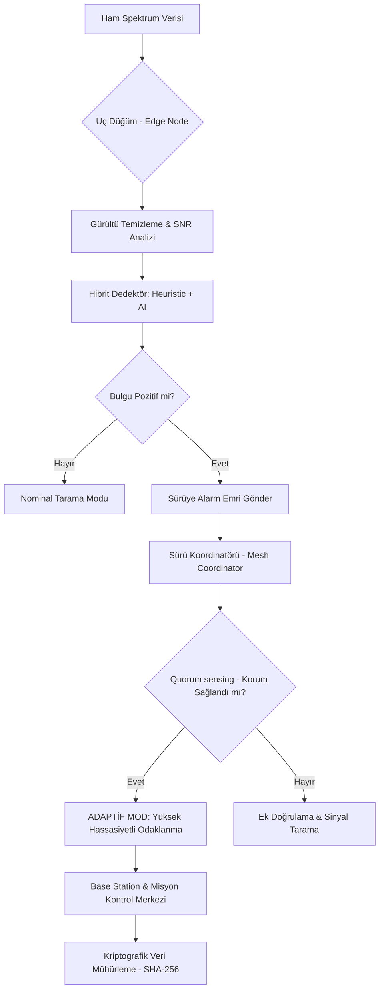

# 🌌 AstroBio-Edge-Architecture: Hükümranlık Katmanı (v0.5.1)


[](#)
[](https://opensource.org/licenses/MIT)
[](https://tua.gov.tr)
[](#)
[](#)

**AstroBio-Edge-Architecture**, merkeziyetsiz astrobiyolojik veri işleme ve otonom sürü zekası (Swarm Intelligence) için tasarlanmış, **"Hükümranlık Katmanı" (Sovereignty Layer)** standartlarında bir teknik ekosistemdir. Proje, derin uzay görevlerinde karşılaşılan ekstrem radyasyon ve devasa veri gecikmesi sorunlarını, keşif noktasında uç bilişim (edge computing) kullanarak aşmayı hedefler. Gerçek zamanlı biyolojik imza tespiti, otonom FDIR (Hata Algılama, İzole Etme ve Kurtarma) ve kriptografik veri bütünlüğü protokolleri ile donatılmış olan bu mimari, insanlığın dünya dışı yaşam arayışındaki teknolojik hakimiyetini temsil eder.

---

## 🚀 Proje Vizyonu: Otonom Keşfin Geleceği ve Veri Darboğazı

Geleneksel uzay görevleri, toplanan ham verinin analizi için yüksek gecikmeli (bazen saatler süren) yer bağlantılarına (Deep Space Network) dayanır. Bu durum, anlık keşif fırsatlarının kaçırılmasına ve kısıtlı bant genişliğinin verimsiz kullanımına neden olur. **AstroBio-Edge**, keşif esnasında kritik biyolojik sinyallerin telemetri darboğazlarından önce tanımlanmasını ve önceliklendirilmesini sağlayan **"Sensörde Hesaplama" (Compute-at-Sensor)** paradigmasını uygular. Sürü bazlı bu yaklaşım, her düğümün (node) kolektif bir zekanın parçası olarak çalışmasını ve "Tek Bir Organizma" (Single Organism Architecture) gibi hareket etmesini sağlayarak, merkezi bir yönetim birimine olan ihtiyacı minimize eder.

### Anahtar Teknolojiler ve Sistem Kabiliyetleri
- **Sürü Zekası (Swarm Intelligence & Quorum Sensing)**: Düğümler arası dinamik konsensüs protokolleri ile bireysel hata paylarını minimize eden kolektif karar alma mekanizması.
- **Adaptif Örnekleme (Adaptive Sampling)**: Bir veya daha fazla düğüm pozitif biyolojik bulgu aldığında, tüm sürünün o bölgeye odaklanması için örnekleme frekansını ve CPU hassasiyetini otonom olarak artırması.
- **Kriptografik Bütünlük (SHA-256 Sealed Packets)**: NASA-STD-8739.8 uyumlu, verilerin kaynaktan hedefe kadar bozulmadığını garanti eden kriptografik mühürleme ve bütünlük kontrolü.
- **Ekstrem Dayanıklılık (Solar Flare Simulation)**: Güneş patlamaları gibi anlık radyasyon felaketlerinde sistemin hayatta kalmasını sağlayan otonom FDIR state-machine katmanı.
- **Rich Mission Control Dashboard**: Komuta merkezine operatör için en yüksek durumsal farkındalığı (Situational Awareness) sağlayan profesyonel terminal arayüzü.

---

## 🏗️ Teknik Mimari ve Sürü Koordinasyon Protokolü

Sistem, **Merkeziyetsiz Dağıtık Hesaplama** prensipleri üzerine inşa edilmiş, çok katmanlı bir hiyerarşiye sahiptir. SAL (Sensor Abstraction Layer), EPE (Edge Processing Engine) ve AI Katmanı arasındaki veri akışı, minimum bellek kullanımı ile maksimum doğruluk sağlayacak şekilde optimize edilmiştir. Aşağıdaki şema, bir biyolojik imza tespiti anında sürünün nasıl bir otonom tepki zinciri oluşturduğunu göstermektedir:



---

## 🧬 Bilimsel Temeller ve Spektroskopik Biyolojik İmza Tespiti

Sistem, `data/biosignatures_db.json` içerisinde tanımlanmış, astrobiyolojik açıdan kritik öneme sahip organik moleküllerin spektral imzalarını (Raman ve LIBS tabanlı) referans alır. Bu veritabanı, bilinen biyolojik işaretçilerin ekstrem ortamlardaki değişimlerini de modelleyen dinamik bir yapıya sahiptir.

### Desteklenen Organik İşaretçiler ve Spektral Analiz
- **Amino Asitler (Glisin, Alanin)**: Yaşamın temel yapı taşları olan bu protein bileşenleri, spektrumun belirli bölgelerinde karakteristik tepe noktaları oluşturur.
- **Biyopigmentler (Klorofil-A, Beta-Karoten)**: Fotosentetik yaşamın ve ultraviyole koruma mekanizmalarının güçlü kanıtları.
- **Metabolik Ürünler (Methane-Ogenic Markers)**: Aktif biyolojik süreçlerin yan ürünü olarak ortaya çıkan kimyasal izler.

### Hibrit Tespit Algoritması (Heuristic + Neural)
Sistem, klasik sinyal işleme algoritmaları (Peak Detection, Baseline Correction) ile modern Derin Öğrenme modellerini hibrit bir yapıda birleştirir. Heuristic katman hızlı ön eleme yaparken, `models/biosignature_nn.py` sinir ağı katmanı karmaşık spektral örüntüleri sınıflandırarak "Kritik Güven Skoru" üretir.

---

## 🛡️ Uzay Dayanıklılığı: FDIR ve Radyasyon Sertleştirme

Uzay ortamı, donanım üzerinde **TID (Total Ionizing Dose)** ve **SEE (Single Event Effects)** gibi yıkıcı fiziksel etkiler yaratır. AstroBio-Edge, yazılımsal tabanlı bir radyasyon sertleştirme ve hata tolerans katmanı sunar.

- **FDIR (Fault Detection, Isolation, and Recovery)**:
    - **Akıllı Güç Yönetimi**: Batarya %20 eşiğinin altına düştüğünde sistem otomatik olarak "Fırsatçı Bilim" (Opportunistic Science) modundan "Düşük Güç" moduna geçer.
    - **Termal Otonomi**: İşlemci yükü nedeniyle artan sıcaklıklar, aktif radyatör valflerini ve CPU frekans sınırlayıcılarını tetikler.
- **Güneş Patlaması (Solar Flare) Dayanıklılığı**: `scripts/stress_tester.py` ile yapılan testlerde, sistemin %100 radyasyon gürültüsü altında bile veri bütünlüğünü koruduğu ve otonom olarak kurtarma protokollerini (Self-Healing) işlettiği doğrulanmıştır.

---

## 📊 Misyon Kontrolü ve Operasyonel Rehber

### Sistem Kurulumu ve Bağımlılıklar
Modern bir Python 3.12+ ortamında çalışan sistem, yüksek performanslı matris işlemleri için `numpy` ve profesyonel görselleştirme için `rich` kütüphanelerine ihtiyaç duyar.
```bash
# Bağımlılıkları tek komutla yükleyin
pip install numpy rich

# Ana Misyon Simülasyonunu başlatın (3 Düğüm, 5 Döngü)
python run_mission.py 3 5
```

### Güvenlik ve Stres Testi (FMEA Raporlaması)
Sistemin limitlerini zorlamak, Solar Flare senaryolarını test etmek ve otonom olarak `docs/STRESS_TEST_REPORT.md` (Hata Modları ve Etkileri Analizi) dosyasını oluşturmak için:
```bash
python scripts/stress_tester.py
```

### Rich Dashboard ve Durumsal Farkındalık
Misyon sırasında `rich` kütüphanesi ile üretilen canlı terminal paneli, sadece logları değil; her düğümün anlık sağlık durumunu, enerji bütçesini, termal grafiklerini ve kriptografik SHA-256 bütünlük mühürlerini saniyeler içinde sunarak operatöre tam hakimiyet sağlar.

---

## 📂 Depo Yapısı ve Modüler Hiyerarşi

Proje, NASA yazılım güvence standartlarına uygun olarak modüler bir yapıda organize edilmiştir:

```tree
.
├── src/                # Çekirdek Otonomi Sistemi (Edge, Mesh, Base Station)
│   ├── utils/          # FDIR, DataLogger, SignalProcessing, Dashboard Manager
├── simulations/        # Sentetik Gezegen Yüzeyi ve Spektroskopi Simülatörleri
├── models/             # Biyolojik İmza Veritabanı ve AI Sınıflandırıcılar
├── hardware/           # Güç Yönetimi ve Sensör Konfigürasyon Dosyaları
├── data/               # Biosignatures JSON Kütüphanesi
├── docs/               # Mimari, Uyumluluk ve Stres Testi Raporları
├── tests/              # Mantıksal Doğrulama ve Sistem Birim Testleri
└── run_mission.py      # Ana Misyon Yürütücü ve Orkestratör (Entry Point)
```

---

## 🤝 Katkıda Bulunma, Vizyon ve Ekip

Bu proje, **TUA AstroHackathon** kapsamında geliştirilmeye başlanmış olup, gelecekteki **TEKNOFEST** görevleri ve Milli Uzay Programı hedefleri için bir teknoloji gösterim platformu niteliğindedir. Derin uzay keşiflerinde otonom hakimiyet ve bilimsel bağımsızlık vizyonuyla geliştirilmektedir.

- **Baş Geliştirici**: [Yunus] - GitHub: [@arch-yunus](https://github.com/arch-yunus)
- **Vizyon**: Milli Uzay Programı ve Gezegenler Arası Keşiflerde Otonom Hakimiyet.

---
*Bu proje MIT Lisansı ile korunmaktadır. Tüm çıktılar T.C. Milli Uzay Programı ve uluslararası uzay dökümantasyon standartlarıyla uyumlu olarak geliştirilmiştir.*
