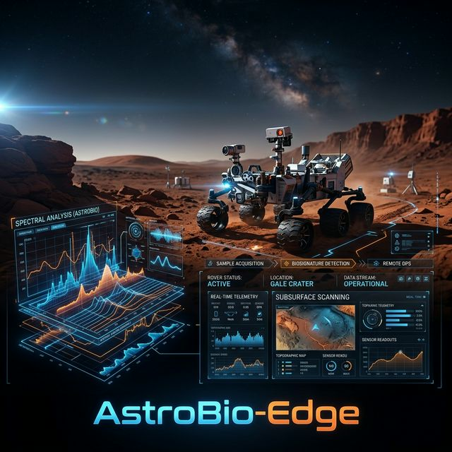

# 🌌 AstroBio-Edge-Architecture: Egemenlik Sınıfı (v0.5.0)



[](#)
[](https://opensource.org/licenses/MIT)
[](https://tua.gov.tr)
[](#)
[](#)

**AstroBio-Edge-Architecture**, merkeziyetsiz astrobiyolojik veri işleme ve otonom sürü zekası (Swarm Intelligence) için tasarlanmış, "Evrensel Sınıf" (Universal-Class) bir teknik ekosistemdir. Proje, keşif noktasında uç bilişim (edge computing) kullanarak, ekstrem uzay koşullarında gerçek zamanlı biyolojik imza tespiti, otonom FDIR (Hata Algılama ve Kurtarma) ve kriptografik veri bütünlüğü sağlar.

---

## 🚀 Proje Vizyonu: Otonom Keşfin Geleceği

Geleneksel uzay görevleri, veri analizi için yüksek gecikmeli yer bağlantılarına dayanır. **AstroBio-Edge**, keşif esnasında kritik biyolojik sinyallerin telemetri darboğazlarından önce tanımlanmasını sağlayan "Sensörde Hesaplama" modelini, **Sürü Zekası** ile birleştirir.

### Anahtar Teknolojiler (v0.5.0 Egemenlik Sınıfı)
- **Sürü Zekası (Swarm Intelligence)**: Düğümler arası dinamik konsensüs (Quorum Sensing).
- **Adaptif Örnekleme**: Pozitif bulgu durumunda sürünün otomatik olarak yüksek hassasiyetli taramaya geçmesi.
- **Kriptografik Bütünlük (SHA-256)**: NASA-STD-8739.8 uyumlu, değiştirilemez veri paketleri.
- **Ekstrem Dayanıklılık**: Solar Flare (Güneş Patlaması) simülasyonu ve otonom hata kurtarma.
- **Rich Mission Control**: Terminalde profesyonel, canlı görsel denetim masası.

---

## 🏗️ Teknik Mimari ve Sürü Koordinasyonu

Sistem, **Merkeziyetsiz Dağıtık Hesaplama** prensipleri üzerine inşa edilmiştir. Aşağıdaki şema, bir biyolojik imza tespiti anında sürünün nasıl tepki verdiğini göstermektedir:

```mermaid
graph TD
    A[Ham Spektrum Verisi] --> B{Uç Düğüm (Edge Node)}
    B --> C[Gürültü Temizleme & SNR Analizi]
    C --> D[Hibrit Dedektör: Kural + AI]
    D --> E{Bulgu Pozitif mi?}
    E -- Hayır --> F[Nominal Tarama Modu]
    E -- Evet --> G[Sürüye Alarm Gönder]
    G --> H[Sürü Koordinatörü (Mesh Coordinator)]
    H --> I{Korum Sağlandı mı?}
    I -- Evet --> J[ADAPTİF MOD: Yüksek Hassasiyetli Odaklanma]
    I -- Hayır --> K[Ek Doğrulama İsteği]
    J --> L[Base Station & Görev Kontrol Merkezi]
    L --> M[Kriptografik Loglama (SHA-256)]
```

---

## 🧬 Bilimsel Temeller ve Biyolojik İmza Tespiti

Sistem, `data/biosignatures_db.json` üzerinden bilinen organik molekülleri tarar.

### Desteklenen Organik İşaretçiler
- **Amino Asitler**: Glisin, Alanin (Protein yapı taşları).
- **Pigmentler**: Klorofil-A, Beta-Karoten (Fotosentetik yaşam göstergeleri).
- **Metabolik Ürünler**: Metan-ojenik Markerlar (Aktif biyolojik süreçler).

### Hibrit Tespit Algoritması
Sistem, klasik sezgisel (heuristic) yöntemlerle modern Sinir Ağlarını (NN) birleştirir:
- **Sezgisel**: Spektral tepe noktası (Peak) eşleştirme ve SNR doğrulaması.
- **AI/ML**: `models/biosignature_nn.py` ile organizma sınıflandırma (Confidence Score).

---

## 🛡️ Uzay Dayanıklılığı ve FDIR Protokolleri

Uzay ortamındaki ekstrem radyasyon (Solar Flare) ve donanım arızalarına karşı sistem otonom olarak hayatta kalır.

- **FDIR (Fault Detection, Isolation, and Recovery)**:
    - **Batarya**: %20 altında "Düşük Güç Modu", %10 altında "Kritik Tasarruf".
    - **Termal**: İşlemci ısındığında aktif radyatör kontrolü ve frekans düşürme.
- **Solar Flare Simülasyonu**: `scripts/stress_tester.py` ile %100 radyasyon yükü altında sistem kararlılığı test edilmiştir.

---

## 📊 Misyon Kontrolü ve Kullanım

### Kurulum
```bash
# Bağımlılıkları yükleyin
pip install numpy rich

# Misyonu başlatın (3 Düğüm, 5 Döngü)
python run_mission.py 3 5
```

### Stres Testi (FMEA Analizi)
Sistemi ekstrem koşullarda test etmek ve `docs/STRESS_TEST_REPORT.md` dosyasını oluşturmak için:
```bash
python scripts/stress_tester.py
```

### Dashboard (Gösterge Paneli)
Misyon sırasında `rich` kütüphanesi ile üretilen canlı terminal paneli, tüm düğüm durumlarını ve bütünlük hash'lerini (SHA-256) anlık olarak sunar.

---

## 📂 Depo Yapısı

```tree
.
├── src/                # Çekirdek işleme mantığı (Edge, Mesh, Base Station)
│   ├── utils/          # FDIR, Logger, Signal Processing, Dashboard
├── simulations/        # Sentetik gezegen yüzeyi ve veri üretim simülatörleri
├── models/             # Biyolojik imza kütüphanesi ve AI sınıflandırıcılar
├── hardware/           # Güç ve Termal yönetim mantığı
├── data/               # Biosignatures JSON veritabanı
├── docs/               # Mimari, Uyumluluk ve Stres Testi Raporları
├── tests/              # Mantıksal ve sistem birim testleri
└── run_mission.py      # Ana misyon yürütücü (Entry Point)
```

---

## 🤝 Katkıda Bulunma ve Ekip

Bu proje, **TUA AstroHackathon** ve gelecekteki **TEKNOFEST** görevleri için bir temel teşkil etmektedir.

- **Geliştirici**: [Yunus] - GitHub: [@arch-yunus](https://github.com/arch-yunus)
- **Vizyon**: Milli Uzay Programı ve derin uzay keşiflerinde otonom hakimiyet.

---
*Bu proje MIT Lisansı ile korunmaktadır. Proje çıktıları T.C. Milli Uzay Programı hedefleriyle uyumlu olarak geliştirilmiştir.*
